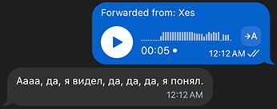

# Telegram Whisper Bot

Telegram bot that transcribes voice messages using OpenAI Whisper Large v3 Turbo via HuggingFace Inference API.

---

## 💬 How it works

👉 [Try it on Telegram](https://t.me/neko_whisper_bot)

Just send a voice, audio or video note and the bot replies with text.



---

## 📦 Setup

### 1. Clone

```shell
git clone https://github.com/yourname/whisper-bot.git
cd whisper-bot
```

### 2. Install deps

```shell
poetry install
```

### 3. Environment

Create `.env` file:

```dotenv
BOT_TOKEN=your_telegram_bot_token
HF_TOKEN=your_huggingface_token
```

### 4. Run

```shell
poetry run python -m whisper_bot.run
```

### 🐳 Docker (optional)

```shell
docker build -t whisper-bot .
docker run --env-file .env whisper-bot
```
